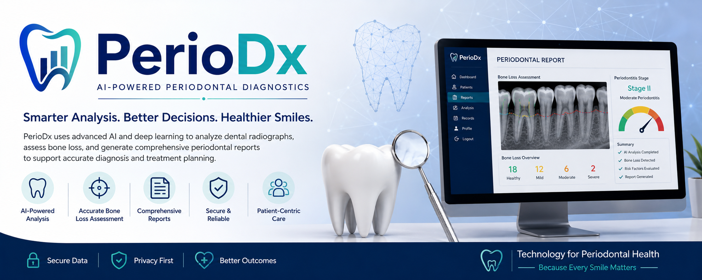

# 🦷 PerioDx



### AI-Powered Periodontal Diagnostic & Reporting System

**PerioDx** is an AI-powered web application designed to assist clinicians in analyzing dental panoramic radiographs, assessing periodontal bone loss, estimating periodontitis stage, and managing patient diagnostic reports.

The system combines a **Flask web application**, **YOLO-based computer vision models**, **MySQL databases**, and a **small language model (SLM)** to provide an integrated periodontal diagnostic workflow.

---
## 🚀 Live Demo

👉 [**Visit PerioDx Live Demo**](https://ruissmarthome.pythonanywhere.com/)


## ✨ Features

* 🦷 **AI Dental X-ray Analysis**

  * Upload panoramic dental radiographs.
  * Analyze teeth using YOLO-based computer vision models.
  * Generate diagnostic visualizations.

* 📊 **Bone Loss Assessment**

  * Calculates CEJ-to-alveolar-crest measurements.
  * Estimates tooth-level bone loss percentage.
  * Categorizes bone loss into normal, mild, moderate, and severe levels.

* 🩺 **Periodontitis Staging**

  * Estimates:

    * Not Classified
    * Stage I
    * Stage II
    * Stage III
    * Stage IV
  * Uses radiographic bone-loss measurements and tooth-loss information.
  * Allows clinician-entered complexity factors to assist Stage III → Stage IV escalation.

* 👤 **Patient Management**

  * Create new patients.
  * Search existing patients.
  * Store patient information.
  * Associate multiple reports with a patient.

* 📋 **Diagnostic Reports**

  * Save AI-generated diagnostic reports.
  * Store per-tooth measurements.
  * View previous reports.
  * Review tooth-level bone-loss information.

* 🔐 **Authentication**

  * Email/password authentication.
  * Google authentication.
  * Session-based user management.

* 🤖 **AI Report Assistant**

  * Sends distilled diagnostic information to an SLM.
  * Allows clinicians to ask questions about a diagnostic report.
  * Keeps the large diagnostic images separate from the model input.

* 💾 **Report Persistence**

  * Temporary diagnostic results are cached on disk.
  * Saved reports are persisted in MySQL.
  * Only the report ID is kept in the Flask session to avoid oversized session cookies.

---

## 🏗️ System Architecture

```text
                    ┌─────────────────────┐
                    │      Clinician      │
                    └──────────┬──────────┘
                               │
                               ▼
                    ┌─────────────────────┐
                    │    Flask Web App    │
                    │   PerioDx Backend   │
                    └──────────┬──────────┘
                               │
              ┌────────────────┼────────────────┐
              │                │                │
              ▼                ▼                ▼
       ┌────────────┐   ┌─────────────┐   ┌─────────────┐
       │   MySQL    │   │ YOLO Models │   │     SLM     │
       │  Database  │   │  Diagnostic │   │ AI Assistant│
       └────────────┘   └──────┬──────┘   └─────────────┘
                               │
                               ▼
                    ┌─────────────────────┐
                    │ Panoramic X-ray     │
                    │ Tooth Analysis      │
                    └──────────┬──────────┘
                               │
                               ▼
                    ┌─────────────────────┐
                    │ Bone Loss & Stage   │
                    │ Assessment          │
                    └─────────────────────┘
```

---

## 🔬 Diagnostic Workflow

```text
Upload Panoramic X-ray
          │
          ▼
   AI Tooth Detection
          │
          ▼
  Tooth Segmentation
          │
          ▼
 CEJ / Alveolar Crest
      Detection
          │
          ▼
 Bone Loss Calculation
          │
          ▼
 Periodontitis Stage
      Estimation
          │
          ▼
 Generate Diagnostic
      Report
          │
          ▼
 Save Patient Report
          │
          ▼
     AI Assistant
```

---

## 📐 Bone Loss Calculation

PerioDx derives the bone-loss percentage from the CEJ-to-alveolar-crest distance and tooth length.

```text
Bone Loss % = (CEJ → AC distance / Tooth length) × 100 − 15
```

The calculated value is floored at `0` and capped at `100` when displaying saved reports.

The application stores the raw pixel measurements and recalculates the derived percentage when a saved report is opened.

---

## 🩺 Periodontitis Staging

The system uses radiographic bone-loss information together with tooth-loss information to estimate periodontal stage.

| Bone Loss  | Estimated Stage |
| ---------- | --------------- |
| < 5%       | Not Classified  |
| 5% – <15%  | Stage I         |
| 15% – <33% | Stage II        |
| ≥33%       | Stage III / IV  |

For the Stage III/IV range, the system uses tooth-loss information and clinician-entered complexity factors.

### Clinical Complexity Factors

* Probing depth ≥ 6 mm
* Vertical bone defect ≥ 3 mm
* Furcation involvement Class II/III
* Fewer than 20 remaining teeth
* Bite collapse / drifting / flaring

> **Important:** PerioDx provides an AI-assisted estimate. Clinical attachment loss (CAL) and other clinical findings require an in-person periodontal examination.

---

## 🦷 FDI Tooth Numbering

The application uses the **FDI tooth numbering system**.

### Upper Jaw

```text
18 17 16 15 14 13 12 11
21 22 23 24 25 26 27 28
```

### Lower Jaw

```text
48 47 46 45 44 43 42 41
31 32 33 34 35 36 37 38
```

Third molars (`18`, `28`, `38`, `48`) are excluded from the tooth-loss count used for staging.

---

## 🗄️ Database Structure

PerioDx uses two MySQL databases.

### Account Database

Stores user authentication information.

```text
users
├── id
├── first_name
├── last_name
├── email
├── password_hash
├── auth_provider
├── provider_user_id
├── created_at
└── updated_at
```

### Dental Reports Database

```text
patients
├── id
├── first_name
├── last_name
├── phone
├── diabetic
├── created_at
└── updated_at

reports
├── id
├── patient_id
├── created_by_user_id
├── report_date
├── periodontitis_stage
├── notes
└── created_at

tooth_measurements
├── id
├── report_id
├── tooth_number
├── cej_ac_distance_px
├── tooth_length_px
└── created_at
```

---

## 🔐 Security

The application includes several security mechanisms:

* Password hashing using Werkzeug.
* Google OAuth authentication.
* Session-based authentication.
* User ownership checks for saved reports.
* Report access restricted to the clinician who created the report.
* Environment variables used for credentials and configuration.
* Diagnostic report images are not stored inside the Flask session.

Sensitive configuration should be stored in `.env` rather than directly in source code.

---

## 📁 Project Structure

```text
PerioDx/
│
├── app.py
├── requirements.txt
├── README.md
├── .env
├── .gitignore
│
├── static/
│   ├── banner.jpg
│   ├── css/
│   ├── js/
│   └── images/
│
├── templates/
│   ├── dashboard.html
│   ├── dashboard_user.html
│   ├── login.html
│   ├── signup.html
│   ├── see_report.html
│   ├── records.html
│   └── periodx_chat.html
│
└── report_cache/
    └── <report-id>.json
```

---

## ⚙️ Environment Variables

Create a `.env` file:

```env
APP_SECRET_KEY=your_secret_key
PYMYSQL_KEY=your_database_password

EMAIL_ID=your_email
EMAIL_KEY=your_email_app_password

GOOGLE_CLIENT_ID=your_google_client_id

COLAB_SERVER_URL=your_diagnostic_server_url
SLM_SERVER_URL=your_slm_server_url
```

**Do not commit `.env` to GitHub.**

Add it to `.gitignore`:

```gitignore
.env
__pycache__/
*.pyc
report_cache/
```

---

## 📦 Installation

### 1. Clone the repository

```bash
git clone https://github.com/Hritik004/PerioDx.git
cd PerioDx
```

### 2. Create a virtual environment

```bash
python -m venv venv
```

Activate it on Windows:

```bash
venv\Scripts\activate
```

On Linux/macOS:

```bash
source venv/bin/activate
```

### 3. Install dependencies

```bash
pip install -r requirements.txt
```

### 4. Configure environment variables

Create `.env` and add the required credentials and server URLs.

### 5. Start the Flask application

```bash
python app.py
```

The application will then be available through the Flask development server.

---

## 🤖 AI Diagnostic Server

The Flask application communicates with a separate diagnostic server.

```text
Flask
  │
  │ POST /predict
  ▼
Colab + YOLO Pipeline
  │
  ├── Tooth detection
  ├── Dental image analysis
  ├── Bone-loss measurements
  └── Report visualization
  │
  ▼
JSON Diagnostic Result
```

The diagnostic server returns generated report images and per-tooth diagnostic information to the Flask application.

---

## 💬 AI Assistant

PerioDx also provides an AI assistant for interpreting diagnostic information.

Instead of sending the complete cached report, the Flask backend creates a smaller JSON representation containing relevant information such as:

```json
{
  "periodontitis_stage_estimate": "Stage II",
  "teeth": {
    "upper": [],
    "lower": []
  }
}
```

This keeps large diagnostic images out of the language-model input and allows the assistant to focus on structured periodontal measurements.

---

## 📊 Report Management

Clinicians can:

```text
Patients
   │
   ├── Patient Information
   │
   ├── Report 1
   │     ├── Periodontitis Stage
   │     └── Tooth Measurements
   │
   ├── Report 2
   │     ├── Periodontitis Stage
   │     └── Tooth Measurements
   │
   └── Report History
```

Reports can be searched by patient name or patient ID, and saved reports can be opened for detailed tooth-level analysis.

---

## 🛠️ Technologies Used

| Technology              | Purpose                                 |
| ----------------------- | --------------------------------------- |
| **Python**              | Backend development                     |
| **Flask**               | Web application framework               |
| **SQLAlchemy**          | Database ORM                            |
| **MySQL**               | Data persistence                        |
| **PyMySQL**             | MySQL connectivity                      |
| **YOLO**                | Dental image analysis                   |
| **Google OAuth**        | Authentication                          |
| **Flask-Mail**          | Email/OTP functionality                 |
| **ngrok**               | Connecting Flask with remote AI servers |
| **Google Colab**        | AI model inference                      |
| **SLM**                 | Diagnostic report assistance            |
| **HTML/CSS/JavaScript** | Frontend                                |

---

## ⚠️ Disclaimer

PerioDx is intended as an **AI-assisted periodontal diagnostic and reporting tool**.

It should not be used as a replacement for professional clinical examination, diagnosis, or treatment planning. Radiographic analysis alone cannot determine all clinical periodontal parameters, including clinical attachment loss and certain complexity factors.

Final clinical decisions should be made by a qualified dental professional.

---

## 👨‍💻 Author

**Hritik Koley**

PerioDx — AI-powered periodontal diagnostic assistance.

---

## ⭐ Project Vision

> **Smarter Analysis. Better Decisions. Healthier Smiles.**

PerioDx aims to combine artificial intelligence, dental imaging, structured clinical data, and language-model assistance into a unified platform for periodontal assessment and reporting.
